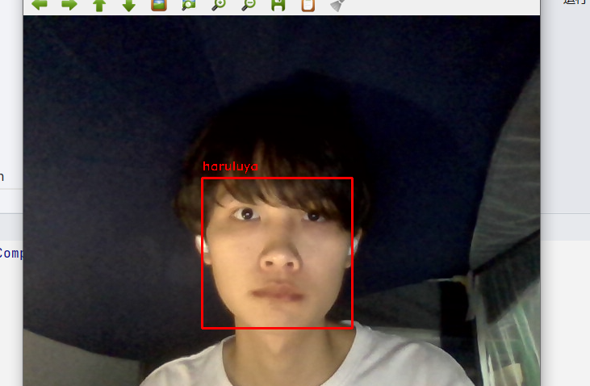

##CV_haruluya
Haruluya's wroks in Computer vision.
###Introduction 

###Development Environment
**Basic**
- python 3.9
- opencv
- NumPy
- Pandas
- Matplotlib

**Another**

- face_location
- TensorFlow
- PyTorch

###Deployment method

###Presentation

### Contact Author 

### License
MIT

