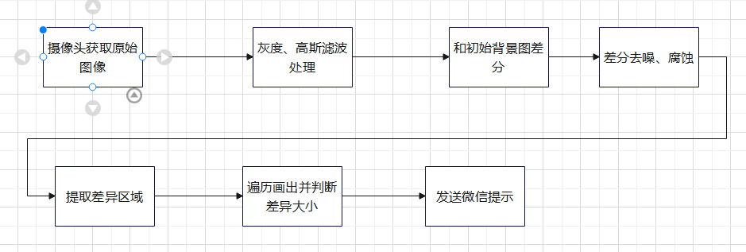
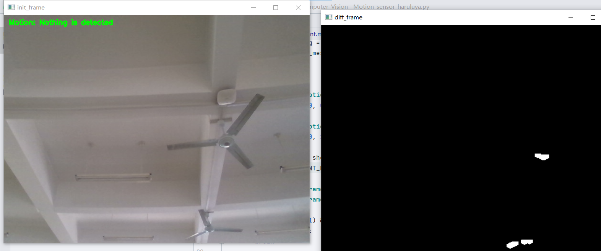
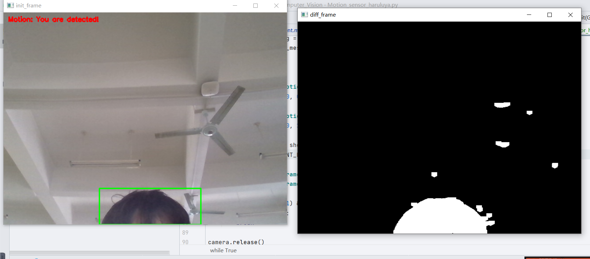
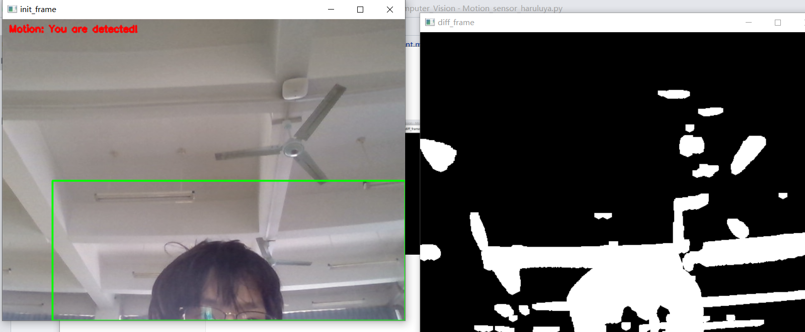
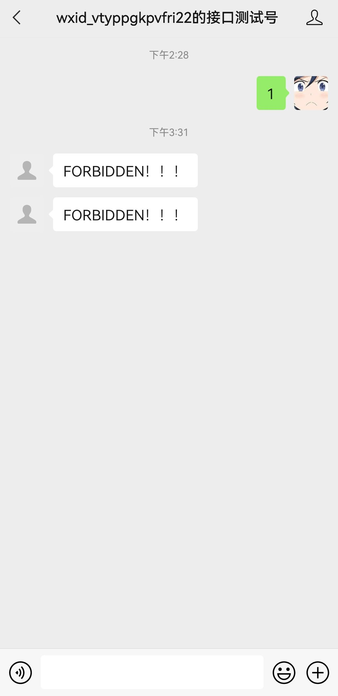

## Motion sensor

**基于absdiff的运动传感**

**@author**

Haruluya

**@date**

2022/4/6

### 介绍

运动传感技术已经开始遍地开花——视频控制台、智能手机、电视遥控器和个人训练设备。本程序基于opencv的abdiff算法实现最基本的运动传感监视功能。程序能够监视静态场景，当场景出现动态物体时，可以通过微信公众号发送警告。


### 基本流程



### 基本实现

#### 环境

- PyCharm2021
- opencv 6

**图片处理**

```python
 grabbed, frame = camera.read()
    # 转换为灰度图后进行高斯滤波。
    gray_frame = cv2.cvtColor(frame, cv2.COLOR_BGR2GRAY)
    gaussian_gray_frame = cv2.GaussianBlur(gray_frame, (25, 25), 3)

```

**求差分**

```python
  #求差分。
    diff = cv2.absdiff(init_background, gray_frame)
    # 去噪。
    diff = cv2.threshold(diff, 50, 255, cv2.THRESH_BINARY)[1]
    # 腐蚀。
    diff = cv2.dilate(diff, es, iterations=3)
    # 获取轮廓。
    contours, hierarchy = cv2.findContours(diff.copy(), cv2.RETR_EXTERNAL,
                                           cv2.CHAIN_APPROX_SIMPLE)
```

**差分值判断**

```python
  # 遍历判断差分大小。
    for c in contours:
        if cv2.contourArea(c) < 2000:
            continue
        (x, y, w, h) = cv2.boundingRect(c)
        cv2.rectangle(frame, (x, y), (x + w, y + h), (0, 255, 0), 2)
        is_find_object = True
        if not is_send_msg:
            is_send_msg = True
            set_wechat_message('FORBIDDEN！！！')
```

**微信提醒**

```python
# 获取access_token。
def get_access_token():
    app_id = 'wxb0a9ca55294303da'
    app_secret = 'a5078045d4e04086f64f3e4bf918c091'
    url = f'https://api.weixin.qq.com/cgi-bin/token?grant_type=client_credential&appid={app_id}&secret={app_secret}'
    resp = requests.get(url).json()
    return resp.get('access_token')

#请求发送消息。
def set_wechat_message(message):
    access_token = get_access_token()
    url = f'https://api.weixin.qq.com/cgi-bin/message/custom/send?access_token={access_token}'
    open_id = "osROc5yIAHNCjcfZAS4Po0XKQE-M"
    req_data = {
        "touser": open_id,
        "msgtype": "text",
        "text":
            {
                "content": f"{message}"
            }
    }
    requests.post(url, data=json.dumps(req_data, ensure_ascii=False).encode('utf-8'))
```

### 效果呈现

**一、无人时静态背景图**




**二、有人出现时**






**三、微信提醒**




### 算法分析

#### cv2.absdiff()

**帧差法**

依据的原则是：

当视频中存在移动物体的时候，相邻帧（或相邻三帧）之间在灰度上会有差别，求取两帧图像灰度差的绝对值，则静止的物体在差值图像上表现出来全是0，而移动物体特别是移动物体的轮廓处由于存在灰度变化为非0，当绝对值超过一定阈值时，即可判断为运动目标，从而实现目标的检测功能。 帧间差分法的优点是算法实现简单，程序设计复杂度低；对光线等场景变化不太敏感，能够适应各种动态环境，有着比较强的鲁棒性。缺点是不能提取出对象的完整区域，对象内部有“空洞”，只能提取出边界，边界轮廓比较粗，往往比实际物体要大。对快速运动的物体，容易出现鬼影的现象，甚至会被检测为两个不同的运动物体，对慢速运动的物体，当物体在前后两帧中几乎完全重叠时，则检测不到物体。故该方法一般适用于简单的实时运动检测的情况。 

**相邻帧间差分法**

相邻帧间差分法直接对相邻的两帧图像做差分运算，并取差分运算的绝对值构成移动物体，优点是运算快速，实时性高，缺点是无法应对光照的突变，物体间一般具有空洞。

本程序采用的为相邻帧间差分法，无法应对光照的突变，如需改进，可调整为三帧差分法。

**三帧差分法**

三帧差法是在相邻帧差法基础上改进的算法，在一定程度上优化了运动物体双边，粗轮廓的现象，相比之下，三帧差法比相邻帧差法更适用于物体移动速度较快的情况，比如道路上车辆的智能监控。
　　三帧差法基本实现步骤如下：首先前两帧图像做灰度差，然后当前帧图像与前一帧图像做灰度差，最后1和2的结果图像按位做“与”操作，进行阙值判断和得出运动目标。

