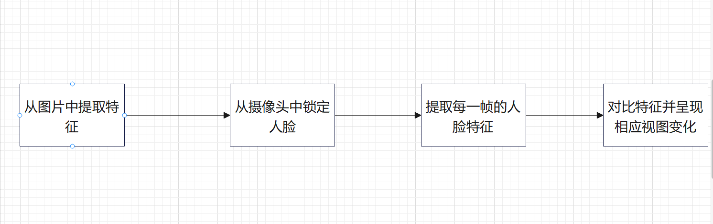
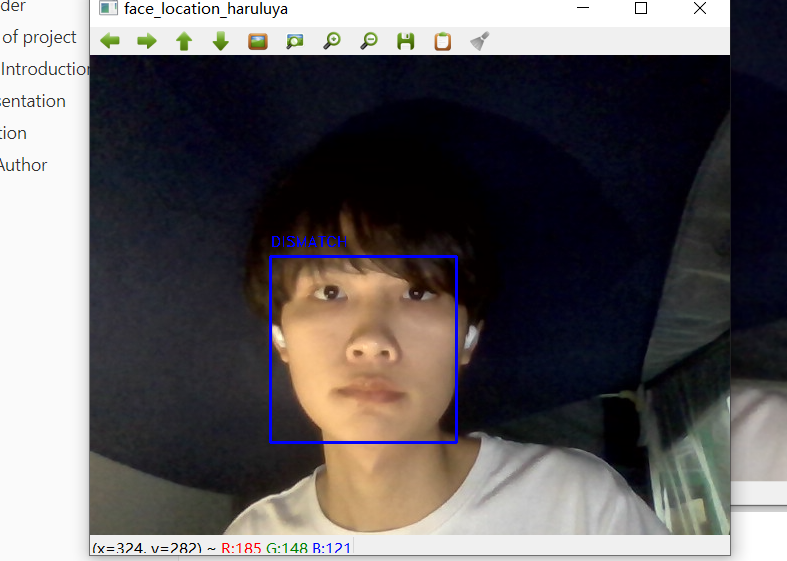
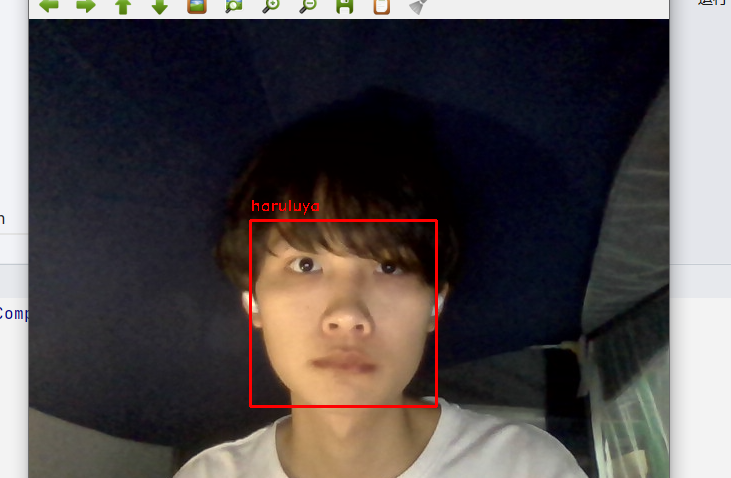

## Face recognition

**@author**

Haruluya

**@date**

2022/4/5

### 介绍

计算机视觉离不开人脸识别，人脸识别在生活中的用处也勿需多论。此**程序**完成基本的人脸识别功能，从已有照片中提取人脸特征，通过摄像头识别人脸与照片中特征是否一致。

### 基本流程



### 基本实现

#### 环境

- PyCharm2021
- face_recognition 1.2.0
- opencv 6

#### 提取人脸特征

```python
    face_locations = face_recognition.face_locations(frame)
    face_encodings = face_recognition.face_encodings(frame, face_locations)
```

#### 匹配人脸特征

```python
    matched_person_name_list = []
    person_name = "DISMATCH"
    for face_encoding in face_encodings:
        result = face_recognition.compare_faces(person_face_data_list, face_encoding)

        for index, _match in enumerate(result):
            if _match:
                person_name = person_face_name_list[index]
                break
        matched_person_name_list.append(person_name)
```

#### 视图变化

```python
    for (top, right, bottom, left), name in zip(face_locations, matched_person_name_list):

        color = (255, 0, 0)
        if name in target_face_name:
            color = (0, 0, 255)
        cv2.rectangle(frame, (left, top), (right, bottom), color, 2)
        font = cv2.FONT_HERSHEY_DUPLEX
        cv2.putText(frame, name, (left, top - 10), font, 0.5, color, 1)
```

### 效果呈现

**一、未匹配的人脸显示DISMATCH**

使用黑人照片作为目标图片时。





**二、匹配的人脸显示对应名称**

使用本人照片作为目标图片时。



### 算法分析

#### face_locations

Face Recognition 库主要封装了dlib这一 C++ 图形库，通过 Python 语言将它封装为一个非常简单就可以实现人脸识别的 API 库，屏蔽了人脸识别的算法细节，大大降低了人脸识别功能的开发难度。Face Recognition 库进行人脸识别主要经过如下步骤：

一、人脸检测：找出所有的面孔

二、检测面部特征点： 使用特征点矫正姿态，将侧脸转为正脸

三、给脸部编码：根据面部特征点计算这个面孔的特征值（特征向量）

四、从编码中找出人的名字：与已知面孔进行特征值比对，寻找匹配的面孔，得到人名

