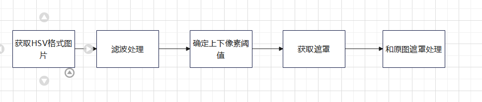
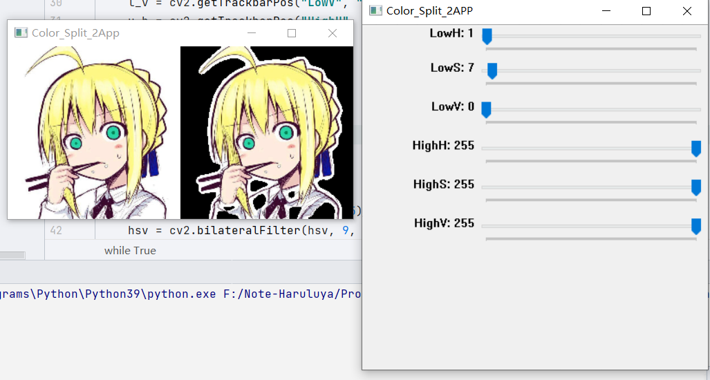
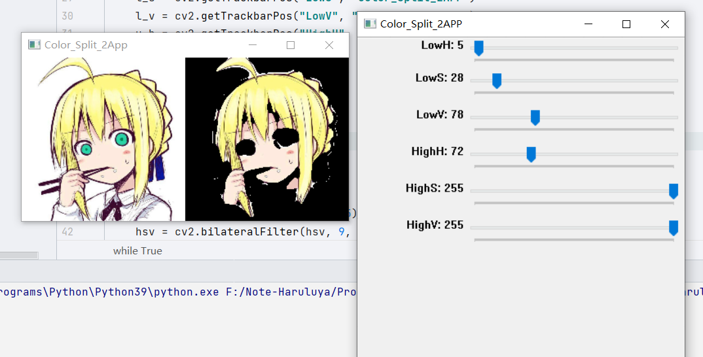
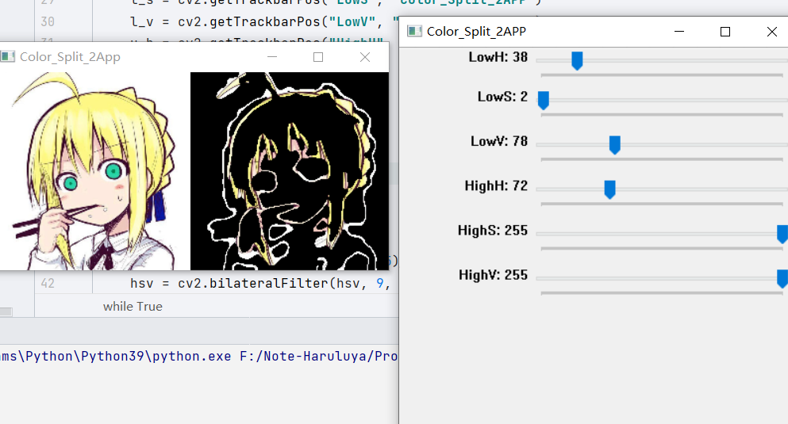

## Color Split

**@author**

Haruluya

**@date**

2022/4/7

### 介绍

颜色分割是指从图片中分离出特定颜色的物体，区域。颜色分割可用于检测身体肿瘤、从森林或海洋背景中提取野生动物的图像，或者从单一的背景图像中提取其他彩色物体。此程序通过滑动滑动条来确定上下阈值对图片进行颜色分割，获取颜色分割后的图像。

### 基本流程



### 基本实现

**HSV格式获取**

```python
#HSV模式。
hsv = cv2.cvtColor(frame, cv2.COLOR_BGR2HSV)
```

**滤波处理**

```python
#滤波处理。
hsv = cv2.blur(hsv, (5, 5))
hsv = cv2.medianBlur(hsv, 5)
hsv = cv2.GaussianBlur(hsv, (5, 5), 0)
hsv = cv2.bilateralFilter(hsv, 9, 75, 75)
```

**遮罩处理**

```python
# 获取遮罩和处理后图片。
mask = cv2.inRange(hsv, l_g, u_g)
#遮罩图片。
res = cv2.bitwise_and(frame, frame, mask=mask)
```

#### 环境

- PyCharm2021
- opencv 6


### 效果呈现

**一、去除背景**




**二、去除眼睛**





**三、获取轮廓**





### 算法分析

#### inRange

函数检测数组元素是否位于其他两个元素之间。

**该函数检测范围方式如下：**

对于单通道输入的每个元素：


对于双通道输入：


同样应用于四通道。

对于多通道的输入，输出结果是各个通道的结果相与，当各通道结果都在上下限之内时，输出为255，否则为0。

